# PULSE: PUE Unified Learning & Simulation Engine

[](#)

**PULSE** is a complete AI-powered platform to create, train, manage and interact with predictive models for energy efficiency in data centers, particularly focused on **PUE (Power Usage Effectiveness)**. By integrating model generation, simulation, live prediction, and intelligent query capabilities via a dashboard interface, PULSE helps organizations optimize energy usage and gain actionable insights in a structured and intuitive way.

---

## 📁 Project structure

```
pulse/
├── backend/
│   ├── main.py
│   ├── .config/
│   │   ├── config.json
│   │   └── statistics.json
│   ├── datasets/
│   ├── models/
│   ├── summaries/
└── frontend/
    ├── public/
    │   └── config.json (.env also supported)
    ├── src/
    │   ├── views/
    │   ├── components/
    │   └── context/
```

---

## ✅ PULSE Benefits

- ⚡ Fully adaptive model training (custom dataset per use case)
- 🔁 Seamless prediction workflow
- 📊 Interactive visual feedback
- 🤖 LLM integration for deeper data interaction
- 🔐 Clean separation of backend/frontend
- 📦 Easy deployment for research or operational use

---

## 📊 Activity Diagram

This diagram outlines the user's flow from opening the web app to receiving feedback:


---

## 💻 Installation requirements

### Backend
- Python 3.9+
- FastAPI
- TensorFlow
- scikit-learn
- joblib
- uvicorn

### Frontend
- Node.js 18+
- Vite
- React
- CoreUI React
- Axios
- Chart.js
- Framer Motion

---

## ⚙️ Installation Ggide

### Backend Setup

```bash
cd backend
python -m venv venv
source venv/bin/activate  # or venv\Scripts\activate on Windows
pip install -r requirements.txt
```

#### Config files:

- `.config/config.json` → active model:
```json
{ "default_model": "ModelName-20250416_120000" }
```

- `.config/statistics.json` → auto-tracked usage:
```json
{
  "predictions_per_month": { "2024-04": 23 },
  "llm_questions": 9
}
```

### Run backend

```bash
uvicorn main:app --reload
```

Docs: http://localhost:8000/docs

---

### Frontend Setup

```bash
cd frontend
npm install
```

#### Config:
`.env`
```
VITE_API_BASE_URL=http://localhost:8000
```

### Run frontend

```bash
npm run dev
```

---

## 📡 API endpoints summary

| Method | Endpoint | Description |
|--------|----------|-------------|
| POST | `/pue/gen/upload_data` | Upload user-provided CSV file |
| POST | `/pue/gen/load_sample` | Load a built-in sample file |
| POST | `/pue/gen/suggest_features` | Automatically suggest best input variables |
| POST | `/pue/gen/train_model` | Train model with selected features |
| POST | `/pue/gen/predict` | Predict PUE from manual input |
| POST | `/pue/gen/example_input` | Return real input example from data |
| GET | `/pue/exp/models` | List all stored models |
| GET | `/pue/exp/summary/{model_name}` | Get metadata for a model |
| DELETE | `/pue/exp/delete/{model_name}` | Remove model and associated files |
| GET | `/pue/exp/download/{model_name}.zip` | Download model + scaler + CSV |
| POST | `/pue/llm/ask` | Ask a question using LLM engine |
| GET | `/pue/set/default_model` | Fetch currently selected model |
| POST | `/pue/set/default_model` | Update active model |
| DELETE | `/pue/set/delete_all` | Remove all stored models |
| GET | `/pue/set/download_all` | Download all models in one zip |
| GET | `/pue/stats` | Get app-wide usage statistics |
| GET | `/pue/stats/dashboard` | Dashboard-ready metrics

---

## 🧠 Main features

### 📊 Dashboard
- Overview of the app
- Graphs (accuracy, usage per month)
- Active model summary
- Cards for navigation

### 📦 PUE Models

- #### 🧱 Generator
    - Upload CSV dataset
    - Suggest and select features
    - Train model (epochs, test size)
    - Save with timestamped name

- #### 🔍 Explorer
    - View all models with summary
    - Table with filter/sort
    - Download or delete

### 🧪 PUE Apps

 - #### 🎯 Manual Predictor
    - Form built dynamically from model summary
    - "Fill Example" button
    - Predict and show result (value + bar graph + animation)

 - #### 💬 LLM Assistant
    - Ask questions about input features, optimization, cooling
    - Context-aware answers based on current model

### ⚙️ Settings

- Select current model (stored in `.config/config.json`)
- Visual server connection status
- App version display
- Delete all models and CSVs
- Download all in one ZIP

---

## 🔄 Application flow

```mermaid
flowchart TD
    A[Start] --> B{User Interface}
    
    B --> C1[📁 PUE Models]
    C1 --> D1[📤 Upload or Load CSV]
    D1 --> E1[🧠 Select Features]
    E1 --> F1[🔁 Train Model]
    F1 --> G1[💾 Save Model, Scaler, Summary]

    B --> C2[📊 PUE Apps]
    C2 --> D2[📝 Fill Inputs]
    D2 --> E2[📈 Predict PUE]
    E2 --> F2[📉 Display Charts & Stats]

    C2 --> D3[💬 Ask Assistant]
    D3 --> E3[📂 Load Model CSV]
    E3 --> F3[🧠 Build Prompt with Context]
    F3 --> G3[🤖 Query LLM Engine]
    G3 --> H3[📡 Stream Response]
    H3 --> I3[🧾 Display Answer]

    B --> C3[⚙️ Settings]
    C3 --> D4[✔️ Set Default Model]
    C3 --> D5[🧹 Delete All]
    C3 --> D6[📥 Download All]

    G1 --> J[✅ Model Ready for Use]
    F2 --> J
    I3 --> J
    D4 --> J

    J --> K[🔁 Repeat or Exit]

```



## 🔁 Sequence diagram


---

## 🧱 Technology notes

- The **frontend** is built using the open-source **[CoreUI React Admin Template](https://coreui.io/react/)** for responsive and elegant UI components.
- The **LLM Assistant** is powered by [**Ollama**](https://ollama.com), a local LLM runtime, with the ability to **select the inference engine** dynamically (e.g., LLaMA, Mistral, or other supported models).

---

## 📎 License

This project is licensed under the **Creative Commons Attribution-NonCommercial 4.0 International (CC BY-NC 4.0)** license.

You are free to:
- Share — copy and redistribute the material in any medium or format
- Adapt — remix, transform, and build upon the material

Under the following terms:
- **Attribution** — You must give appropriate credit.
- **NonCommercial** — You may not use the material for commercial purposes.

For full details, see the [license summary](https://creativecommons.org/licenses/by-nc/4.0/) or the [full legal text](https://creativecommons.org/licenses/by-nc/4.0/legalcode).

---

## 👥 Authors & contact

PULSE is a project developed for educational, research and operational usage in smart energy management and digital twins in data centers. For inquiries, collaboration, or contributions, please contact:

 - Daniel Flores-Martin: [dfloresm@unex.es](mailto:dfloresm@unex.es)

We welcome suggestions, issues and contributions from the community!

