# PULSE: PUE Unified Learning & Simulation Engine

[](#)

**PULSE** is a complete AI-powered platform to create, train, manage and interact with predictive models for energy efficiency in data centers, particularly focused on **PUE (Power Usage Effectiveness)**. By integrating model generation, simulation, live prediction, and intelligent query capabilities via a dashboard interface, PULSE helps organizations optimize energy usage and gain actionable insights in a structured and intuitive way.

---

## 📁 Project structure

```
pulse/
├── backend/
│   ├── main.py
│   ├── .config/
│   │   ├── config.json
│   │   └── statistics.json
│   ├── datasets/
│   ├── models/
│   ├── summaries/
└── frontend/
    ├── public/
    │   └── config.json (.env also supported)
    ├── src/
    │   ├── views/
    │   ├── components/
    │   └── context/
```

---

## ✅ PULSE benefits

- ⚡ Fully adaptive model training (custom dataset per use case)
- 🔁 Seamless prediction workflow
- 📊 Interactive visual feedback
- 🤖 LLM integration for deeper data interaction
- 🔐 Clean separation of backend/frontend
- 📦 Easy deployment for research or operational use

---

## 📊 Architecture overview

This diagram outlines the user's flow from opening the web app to receiving feedback:


---

## 💻 Installation requirements

### Backend
- Python 3.9+
- FastAPI
- TensorFlow
- scikit-learn
- joblib
- uvicorn
- Ollama

### Frontend
- Node.js 18+
- Vite
- React
- CoreUI React
- Axios
- Chart.js
- Framer Motion

---

## ⚙️ Installation guide

### Backend setup

```bash
cd backend
python -m venv venv
source venv/bin/activate  # or venv\Scripts\activate on Windows
pip install -r requirements.txt
```

#### Ollama installing (for LLM features)

```bash
curl -fsSL https://ollama.com/install.sh | sh
# Install models engines
ollama run phi
ollama run tinyllama
ollama run llama2 
ollama run mistral
ollama run gemma
# Configure as a service
sudo systemctl enable ollama
sudo systemctl start ollama
# Check Ollama
sudo systemctl status ollama
```

#### Config files

- `.config/config.json` → active model:
```json
{ "default_model": "ModelName-20250416_120000" }
```

- `.config/statistics.json` → auto-tracked usage:
```json
{
  "predictions_per_month": { "2024-04": 23 },
  "llm_questions": 9
}
```

### Run backend

```bash
uvicorn main:app --reload
```

Docs: http://localhost:8000/docs

---

### Frontend setup

```bash
cd frontend
npm install
```

#### Config
`.env`
```
VITE_API_BASE_URL=http://localhost:8000
```

#### Default login
```
Username: admin
Password: admin
```
Change it in:
 - `backend/.env`

### Run frontend

```bash
npm run dev
```

---

## 📡 API endpoints summary

### 🧩 Backend endpoints

#### Login
| Method | Endpoint                             | Description             |
|--------|--------------------------------------|-------------------------|
| POST   | `/auth/login`                        | Login in PULSE          |

#### PUEModelGenerator

| Method | Endpoint                             | Description             |
|--------|--------------------------------------|-------------------------|
| POST   | `/pulse/generator/upload_data`               | Upload Data             |
| POST   | `/pulse/generator/load_sample`               | Load Sample             |
| POST   | `/pulse/generator/suggest_features`          | Suggest Features        |
| POST   | `/pulse/generator/train_model`               | Train Model             |
| POST   | `/pulse/generator/predict`                   | Predict PUE             |
| GET    | `/pulse/generator/example_input/{model}`     | Get Example Input       |
| POST   | `/pulse/generator/automl_train`              | AutoML Train Streaming  |
| POST   | `/pulse/generator/save_automl_model`         | Save AutoML Model       |
| DELETE | `/pulse/generator/simulation/delete/{model}/{timestamp}` | Simulation Delete |

#### PUEModelExplorer

| Method | Endpoint                                      | Description             |
|--------|-----------------------------------------------|-------------------------|
| POST   | `/pulse/explorer/simulations/clear`                  | Simulations Clear       |
| GET    | `/pulse/explorer/models`                             | List Models             |
| GET    | `/pulse/explorer/summary/{model_name}`               | Get Model Summary       |
| DELETE | `/pulse/explorer/delete/{model_name}`                | Delete Model            |
| GET    | `/pulse/explorer/download/{model_name}.zip`          | Download Model Zip      |

#### PUEDatasets

| Method | Endpoint                                      | Description             |
|--------|-----------------------------------------------|-------------------------|
| GET    | `/pulse/datasets/list`                          | List Datasets           |
| GET    | `/pulse/datasets/load/{dataset_name}`           | Load Dataset            |
| POST   | `/pulse/datasets/filter`                        | Filter Dataset          |
| GET    | `/pulse/datasets/plots/{dataset_name}`          | Generate Plots          |

#### PUELLM

| Method | Endpoint              | Description             |
|--------|-----------------------|-------------------------|
| POST   | `/pulse/llm/ask`        | Ask Question            |

#### PUEHistory

| Method | Endpoint                                     | Description                |
|--------|----------------------------------------------|----------------------------|
| GET    | `/pulse/history/{model_name}`                      | Get Model History          |
| DELETE | `/pulse/history/clear_llm/{model_name}`            | Clear LLM History          |
| DELETE | `/pulse/history/clear_simulations/{model_name}`    | Clear Simulations History  |
| DELETE | `/pulse/history/delete_item`                       | Delete History Item        |

#### PUESettings

| Method | Endpoint                    | Description             |
|--------|-----------------------------|-------------------------|
| GET    | `/pulse/settings/default_model`    | Get Default Model       |
| POST   | `/pulse/settings/default_model`    | Set Default Model       |
| DELETE | `/pulse/settings/delete_all`       | Delete All Models       |
| GET    | `/pulse/settings/download_all`     | Download All Models     |
| DELETE | `/pulse/settings/purge`            | Purge Orphan Files      |

#### PUEStats

| Method | Endpoint               | Description             |
|--------|------------------------|-------------------------|
| GET    | `/pulse/statistics`           | Get Statistics          |
| GET    | `/pulse/statistics/dashboard` | Get Dashboard Stats     |

---

## 🧠 Main features

### 📊 Dashboard
- Overview of the app
- Graphs (accuracy, usage per month)
- Active model summary
- Cards for navigation

### 📦 PUE Models

- #### 🧱 Generator
    - Upload CSV dataset
    - Suggest and select features
    - Train model (epochs, test size)
    - Save with timestamped name
- #### 🤖 Auto ML generator
    - Upload and analyze dataset structure
    - Automatically select optimal input features
    - Run automated model training pipeline
    - Review suggested configuration before saving
- #### 🔍 Explorer
    - View all models with summary
    - Table with filter/sort
    - Download or delete

### 🧪 PUE Apps

 - #### 🎯 Manual predictor
    - Form built dynamically from model summary
    - "Fill Example" button
    - Predict and show result (value + bar graph + animation)
- #### 🧪 Scenario simulator
    - Fill inputs from real examples
    - Modify inputs to explore what-if scenarios
    - Compare original vs simulated PUE (horizontal bar chart)
    - Save simulations with timestamp and inputs
    - View, re-run, delete or clear simulations
    - Visualize simulation history
- #### 📚 History
    - Chronological log of simulations and LLM queries per model
    - View detailed input/output for each action
    - Replicate actions on other compatible models
    - Delete individual history items
    - Compare results graphically across models
 - #### 💬 LLM assistant
    - Ask questions about input features, optimization, cooling
    - Context-aware answers based on current model

### ⚙️ Settings

- Select current model (stored in `.config/config.json`)
- Visual server connection status
- App version display
- Delete all models and CSVs
- Download all in one ZIP
- Purge orphaned files (e.g. outdated summaries or scalers)

---

## 🔄 Application flow

```mermaid
flowchart TD
    A[Start] --> B{User Interface}

    B --> C1[📁 PUE Models]
    C1 --> D1[🧱 Model generator]
    D1 --> D1a[📤 Upload or load CSV]
    D1a --> D1b[🧠 Select features]
    D1b --> D1c[🔁 Train model]
    D1c --> D1d[💾 Save model, scaler, summary]

    C1 --> D2[🤖 AutoML generator]
    D2 --> D2a[📤 Upload CSV]
    D2a --> D2b[⚙️ Auto analyze & train]
    D2b --> D1d

    C1 --> D3[🔍 Model explorer]
    D3 --> D3a[📄 View summary + metrics]
    D3 --> D3b[📊 Explore dataset + plots]
    D3 --> D3c[🧪 Review simulations]

    B --> C2[📊 PUE Apps]
    C2 --> E1[🎯 Predictor]
    E1 --> E1a[📝 Fill inputs]
    E1a --> E1b[📈 Predict PUE]
    E1b --> E1c[📉 Display results]

    C2 --> E2[🧪 Simulator]
    E2 --> E2a[🧾 Load scenario inputs]
    E2a --> E2b[🔁 Modify inputs]
    E2b --> E2c[📊 Compare current vs simulated]
    E2c --> E2d[🗂️ View, save or delete history]

    C2 --> E3[💬 LLM Assistant]
    E3 --> E3a[📂 Load model context]
    E3a --> E3b[🤖 Ask question]
    E3b --> E3c[📡 Stream response]

    C2 --> E4[📚 History]
    E4 --> E4a[📆 Chronological log of actions]
    E4a --> E4b[👁️ View, replicate or delete]
    E4b --> E4c[📊 Compare outputs across models]

    B --> C3[⚙️ Settings]
    C3 --> F1[✔️ Set default model]
    C3 --> F2[🧹 Purge files]
    C3 --> F3[🗑️ Delete all]
    C3 --> F4[📥 Download all]

    D1d --> G[✅ Model ready]
    E1c --> G
    E2c --> G
    E3c --> G
    E4c --> G
    F1 --> G

    G --> H[🔁 Repeat or exit]

```



## 🔁 Sequence diagram


---

## 🧱 Technology notes

- The **frontend** is built using the open-source **[CoreUI React Admin Template](https://coreui.io/react/)** for responsive and elegant UI components.
- The **LLM Assistant** is powered by [**Ollama**](https://ollama.com), a local LLM runtime, with the ability to **select the inference engine** dynamically (e.g., LLaMA, Mistral, or other supported models).

---

## 📎 License

This project is licensed under the **Creative Commons Attribution-NonCommercial 4.0 International (CC BY-NC 4.0)** license.

You are free to:
- Share — copy and redistribute the material in any medium or format
- Adapt — remix, transform, and build upon the material

Under the following terms:
- **Attribution** — You must give appropriate credit.
- **NonCommercial** — You may not use the material for commercial purposes.

For full details, see the [license summary](https://creativecommons.org/licenses/by-nc/4.0/) or the [full legal text](https://creativecommons.org/licenses/by-nc/4.0/legalcode).

---

## 👥 Authors & contact

PULSE is a project developed for educational, research and operational usage in smart energy management and digital twins in data centers. For inquiries, collaboration, or contributions, please contact:

 - Daniel Flores-Martin: [dfloresm@unex.es](mailto:dfloresm@unex.es)

We welcome suggestions, issues and contributions from the community!

